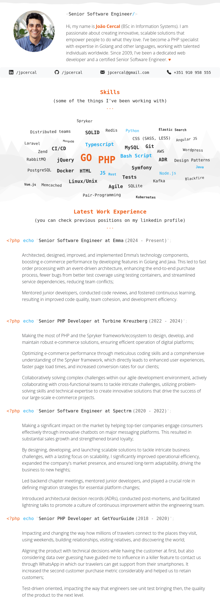

# Resume

As a software engineer with a thirst for adventure, I'm constantly seeking ways
to enhance my skills and tackle new challenges. Recently, I embarked on a
project to create a resume generator that utilizes JSON resume schema files to
produce polished PDF resumes. This project allowed me to delve into the world of
resume automation, exploring both its potential benefits and potential pitfalls.

## How do I access João's resume?

Above you see a preview about how João's resume file looks like. Below there are
two links where you can: 

- [View it]( https://github.com/jpcercal/resume/blob/main/resume.pdf) or;
- [Download it](
https://raw.githubusercontent.com/jpcercal/resume/main/resume.pdf). 

For the tech-savvy, the detailed information is stored in the JSON file
[resume.json](https://raw.githubusercontent.com/jpcercal/resume/main/resume.json),
you can see a preview of how this file looks like below: 

And, of course you are welcome to check the workflow
`.github/workflows/resume.yml` or simply click here [Github
Actions](https://github.com/jpcercal/resume/actions).

## Some background about what has been done

To fully appreciate the project's potential, let's first gain a grasp of the
groundwork that has already been laid.

### Setting the Stage: Introducing the Resume Generator

The heart of this project lies in a file named `resume.json`, which serves as
the source of truth for the generated `resume.pdf`. This file contains
meticulously crafted JSON data, outlining my educational background,
professional experiences, skills, and other relevant information. To ensure the
integrity of this data, I used the
[resumed](https://github.com/rbardini/resumed) library, a powerful tool for
validating JSON resume schema compliance.

After validating the `resume.json` file, the `resumed` library kicks off the
next phase: generating the HTML template for the resume. This template serves as
the foundation for the final PDF document, ensuring a consistent and visually
appealing layout. The HTML template is then fed into
[puppeteer](https://pptr.dev/), a headless browser automation library, which
takes care of rendering the HTML content and generating the PDF file.

### Harvesting the Fruits of Automation: the Pros of the Approach 

The allure of this project lies in its ability to automate the tedious task of
generating PDF resumes. This automation has several advantages:

1. Consistency and Accuracy: By relying on automated processes, we can ensure
that every resume produced adheres to a consistent format and contains accurate
information. This eliminates the risk of human error and ensures a professional
presentation.

2. Efficiency and Time Savings: Automating the resume generation process saves a
significant amount of time and effort. Instead of manually crafting each PDF, we
can focus on more strategic content creation and job search activities.

3. Navigating the Challenges: Cons of the Approach While the benefits of
automation are undeniable, there are also some potential drawbacks to consider:

4. Data Dependency/validation: The success of this approach hinges on the
accuracy and completeness of the resume.json data. Any inconsistencies or
missing information will directly impact the generated PDF.

5. Technical Expertise: Implementing and maintaining this automation pipeline
requires a certain level of technical proficiency. Developers with experience in
JSON, HTML, and headless browser automation will be well-equipped for this task.
Although anyone can easily edit the resume.json file, which is all that is
needed.

6. Customization Flexibility: While the template generated by resumed provides a
solid foundation, it may not always align perfectly with individual preferences.
Some users may require more customization options to achieve the desired look
and feel. But, it's easy to do, just install any template or extend the one from
this project which lives under the folder `theme`.

### Conclusion

This resume generator project has been an exciting journey into the world of
automation and resume creation. It's gratifying to have developed a tool that
can streamline the resume-building process and enhance the overall job search
experience. While there are challenges to consider, the benefits of automation
make it an attractive approach for many. As a software engineer, I'm eager to
continue exploring automation techniques and expanding my skillset.
